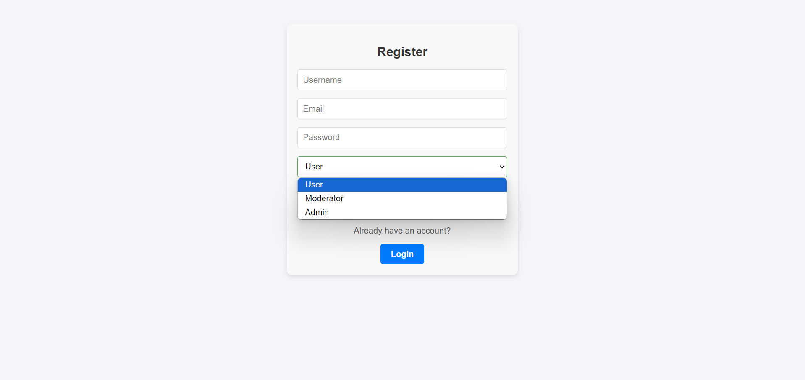

# Authentication and Role-Based Access Control (RBAC) System

A comprehensive full-stack project implementing **authentication** and **authorization** features with **Role-Based Access Control (RBAC)**. Users can register, log in, and access role-specific resources securely.

---

## Features

### Authentication
- User registration and login functionality.
- Secure password hashing with **bcrypt**.
- Token-based session management using **JWT**.

### Authorization
- **Role-Based Access Control (RBAC)** with three roles:
  - **Admin**: Access to all resources and management tools.
  - **Moderator**: Access to moderated resources.
  - **User**: General access to user resources.

### Frontend
- Built with **React.js** for dynamic and responsive UI.
- **React Router** for navigation and protected routes.
- Login, Register, and Dashboard pages with styled components.

### Backend
- RESTful APIs for authentication and data handling.
- Middleware for role validation and JWT verification.

---

## Technologies Used

### Backend
- **Node.js** and **Express.js**: Server-side framework.
- **MongoDB**: NoSQL database for storing user data.
- **JWT**: JSON Web Tokens for secure authentication.
- **bcrypt**: Library for password hashing.

### Frontend
- **React.js**: UI development.
- **React Router**: Client-side routing.
- **CSS**: Styling for pages and components.

---

## Prerequisites

- Node.js and npm installed on your system.
- MongoDB database setup (local or cloud, e.g., MongoDB Atlas).

---

## Setup Instructions

### 1. Clone the Repository
```bash
git clone <repository-url>
cd <repository-directory>
```
### 2. Backend Setup
Navigate to the backend directory:

```bash

cd backend
```
Install dependencies:

```bash

npm install
```
Create a .env file in the backend directory and add the following:

env
Copy code
PORT=5000
MONGO_URI=<your-mongo-db-uri>
JWT_SECRET=<your-jwt-secret-key>
Start the backend server:

```bash

npm start
```
### 3. Frontend Setup
Navigate to the frontend directory:

```bash
cd frontend
```
Install dependencies:

```bash

npm install
```
Start the React development server:

```bash

npm start
```
## Screenshots  

1. **Login Page**
   
     

3. **Register Page**
   
     

5. **Dashboard with User Access**
   
     

7. **User Cannot Access Other Permissions**
   
     
